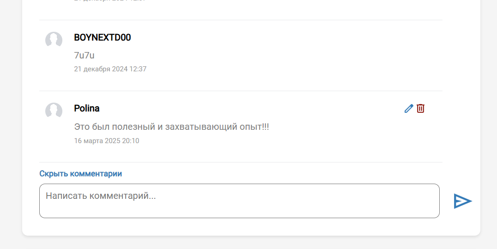
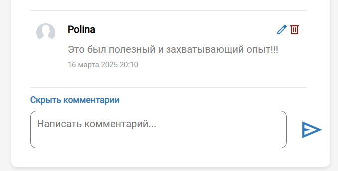
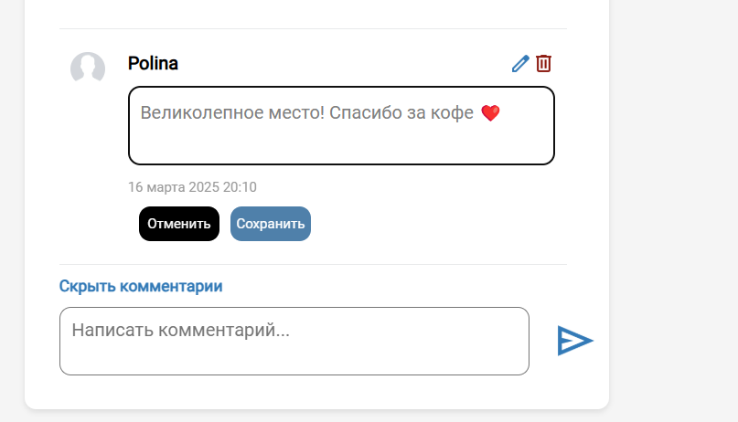
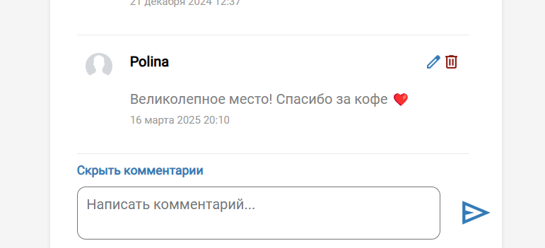
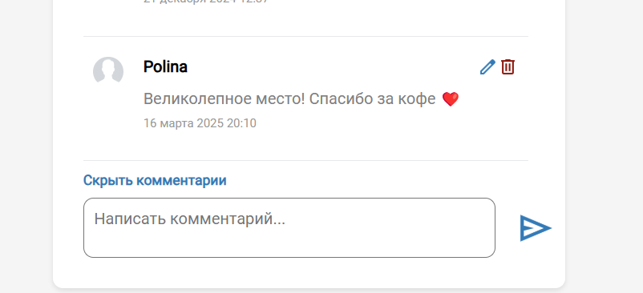

#### Проверка создания комментарии

URL: https://pushart.online/profile 
https://pushart.online/api/posts/posts/<postID>/comments/create

__Ввести в поле комментария текст__

_Ожидаемый результат:_
- Создастся комментарий с введенным текстом

_Фактический результат:_
- Создался комментарий с введенным текстом

✅ Поведение корректное

#### Проверка созданного комментария после обновления

URL: https://pushart.online/profile

__Обновляем страницу__

_Ожидаемый результат:_
- Созданный комментарий останется у поста

_Фактический результат:_
- Созданный комментарий остался у поста

✅ Поведение корректное

#### Проверка изменения комментарии

URL: https://pushart.online/profile 
https://pushart.online/api/posts/posts/<postID>/comments/update

__Нажать на кнопку карандаша. Ввести в поле комментария текст. Нажать на кнопку сохранить__

_Ожидаемый результат:_
- Текст старого комментария изменится на новый

_Фактический результат:_
- Текст старого комментария изменился на новый

✅ Поведение корректное

#### Проверка измененного комментария после обновления

URL: https://pushart.online/profile

__Обновляем страницу__

_Ожидаемый результат:_
- Созданный комментарий останется у поста

_Фактический результат:_
- Созданный комментарий остался у поста

✅ Поведение корректное

